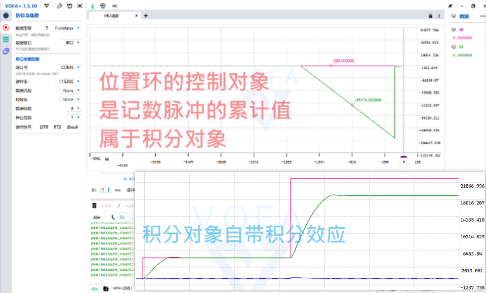
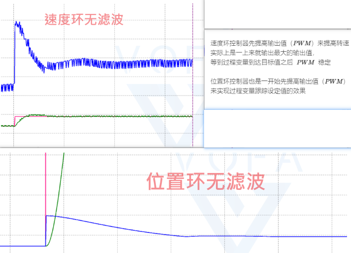

# 自动驾驶相关的组件学习记录

## 参考链接

PID 视频教程
- b 站搜索 PID 关键词有很多 

arduino PID 库作者的博客，源码仓库
-  [br3ttb/Arduino-PID-Library (github.com)](https://github.com/br3ttb/Arduino-PID-Library)
-  [Introducing Proportional On Measurement | Project Blog (brettbeauregard.com)](http://brettbeauregard.com/blog/2017/06/introducing-proportional-on-measurement/)
-  [pid | Search Results | Project Blog (brettbeauregard.com)](http://brettbeauregard.com/blog/?s=pid)
- [中文翻译](https://www.cnblogs.com/FZLGYZ/p/11696252.html)

调参助手
- 安利 VOFA+
## 闭环控制和控制量

首先需要了解一些闭环控制、开环控制的概念，以及对应的使用场景和作用

然后得要明白在一个系统中要控制的对象是什么属于量，要明白这个量的类型是什么（自衡对象还是积分对象）

## PID 闭环控制相关的概念

$\displaystyle PID$ 算法的数学表达形式具体有几种类型，这个知道了解一下就行，**在这里建立 $\displaystyle PID$ 算法的感性认识就行了**
> 值得一提的是一般的 $MCU$ 是离散系统，离散系统时间横轴最小变化量为 1，除以 1 等于没除

**$\displaystyle P$ 算法就像挂在预期值上的一根弹簧**，因为 $\displaystyle K_{p}e_{k}$ 有点像弹簧的胡克定律 $\displaystyle F=-kx$ 嘛。它总有把实际值往预期值位置拉的能力。这里的 $\displaystyle e_{k}$ 就是预期值和实际值之差的绝对值，表示的是实际值和预期值之间的误差。**由 $\displaystyle K_{p}e_{k}$ 可以看出来误差如果越大，那么 $\displaystyle P$ 算法的输出就越大。进而用增大的 $\displaystyle P$ 算法输出去减小实际值和预期值之间的误差，让实际值值不断接近预期值**
> $\displaystyle P$ 参数 $\displaystyle K_{p}$ 越大，弹簧的恢复能力就越大。但是 $\displaystyle P$ 参数不是越大越好，如果 $\displaystyle P$ 参数越大，那很容易就恢复过头，**实际值就像弹簧一样在预期值附近振荡，不能很好的快速稳定**，这种实际值在预期值附近振荡的现象就是**弹簧过冲现象**

$\displaystyle D$ 算法就像阻尼，所谓的阻尼指的就是阻碍系统的变化的东西，就跟楞次定律一样，和误差变化趋势相反。因为 $\displaystyle K_{d}(e_{k}-e_{k-1})=K_{d} \frac{e_{k}-e_{k-1}}{1}$，$\displaystyle (e_{k}-e_{k-1})$ 是两次误差之差，和系统响应 (也就是误差调整的速度) 有关，所以 $\displaystyle D$ 算法和水的阻力 $\displaystyle F=kv$ 很像，它就好像放在水里的弹簧，弹簧的速度越快，受到水的阻力越大，越难继续恢复。因此可以把 $\displaystyle D$ 算法理解为阻尼，抑制过冲现象

**如果误差值 $\displaystyle e_{k}$ 很大或者 $\displaystyle P$ 参数很大，那么 $\displaystyle P$ 算法的输出就会很大，进而导致系统剧烈响应，也就是两次误差之差 $\displaystyle (e_{k}-e_{k-1})$ 很大，进而用输出变大的 $\displaystyle D$ 算法来阻碍系统的变化，使得输出停在预期值而不过冲**。由于 $\displaystyle (e_{k}-e_{k-1})$ 有正有负，所以要灵活调节 $\displaystyle K_{d}$ 使得 $\displaystyle P$ 算法输出和 $\displaystyle D$ 算法输出的效果反相
> 实际情况中，如果 $\displaystyle D$ 参数过大，会产生一种高频率小幅度的震荡，就像在抽搐一样。这是因为如果 $\displaystyle D$ 参数太大，那么系统的任何轻微变化都会引起 $\displaystyle D$ 算法的强烈响应

$\displaystyle I$ 算法是误差的累加。由 $\displaystyle K_{i} \sum \limits_{j=1}^{k}e_{j}$ 可以看出，只要存在误差 (这种误差叫稳态误差)，不论误差有多小，$\displaystyle I$ 的输出也会像滚雪球样越滚越大。它输出是作用是就是消除稳态误差。因为当系统误差已经接近 0 时，$\displaystyle P$ 的输出会很小，起不到继续减小误差的作用，导致误差始终没办法减小到 0。这个时候就需要用到 $\displaystyle I$ 算法让误差值不断累加并将累加后的值输出，进而消除稳态误差。这就是更精确的控制

但是有时候，加入 $I$ 算法的系统，会不太稳定。因为误差是不断累加的，加上 $\displaystyle I$ 加的次数太多而没有给 $\displaystyle I$ 的输出限幅的话，系统容易崩。一般实际使用的时候稳态误差还是处在可以接受的范围，所以没有特别需要的话，$PD$ 控制就可以了。实在要使用 $\displaystyle I$ 算法的话，要限制误差累加的幅度，限制最大值和最小值
> 如果使用超调过冲的参数整定方式，一般先调 $\displaystyle P$ 然后是 $\displaystyle D$，几乎不会动 $\displaystyle I$
> 但是如果使用更流程化的 `Lambda` 参数整定方法，直接可以得出 $P$ 和 $\displaystyle I$ 了，不需要用到 $\displaystyle D$ 即可有不错的效果

总而言之，$\displaystyle P$ 是根据现在的误差位置控制，$\displaystyle D$ 又是根据未来控制（微分表示误差变化趋势 ）$\displaystyle I$ 是根据过去的控制（积分误差过去的累积）

## FOC 无刷电机控制

有刷因为换向点有限只能做到有限细分的力矩控制。转子和磁链的角度不是恒定 90 度的，而是依据电刷细分数在 90 度附近周期性波动。有点类似 6 步方波控制。因为电刷的存在，其长期高可靠运行时不行的

这只是有刷不再大规模使用的一个原因，并不能排除掉直流有刷电机从原理上的优秀的控制性能。因此对于很多其他的电动机来说，对于其控制策珞的研究，就是要向直流有刷电机看齐

实际上 FOC 的根本目的，就是利用磁链解耦把无刷电机“有刷”化，可以通过闭环直接给电流信号来控制力矩、速度、位置，而不用考虑电角度和换向的问题

## 对电机三环的 $\displaystyle PID$ 整定

位置环的对象是积分对象，在目标值设定不大的时候，用积分对象自带的积分作用就可以有不错的效果。但是一旦目标值大的时候，用积分对象自带的就不够用了，会有积分作用弱的表现（有稳态余差）

> 顺带一题，稳态鱼叉有可能是因为设定值是本来设定的就有问题，比如电机最大转速参数虚标，或者顺时针转逆时针转的效果不一样

速度环和位置环（内核是普通并联式 $\displaystyle PID$）就已经可以最快达到想要的控制了 (因为一上来 $PWM$ 都是拉满)
单纯的控制性能角度上讲，单独的环已经足够了

如果有以指定速度转多少圈的需求，才需要使用位置环串联速度环

电流环呢，资助孩子买个电流回传的无刷电机和驱动板好伐？

## MATLAB-simulink 仿真和辅助整定 $\displaystyle PID$

Matlab 仿真和自动调参-哔哩哔哩 https://b23.tv/eJlG5b6
- 开源了控制的完整程序： ①常规 PID ②改进式 PID ③MATLAB 系统辨识传递函数 ④Simulink 仿真&PID Tuner 
- 自动调参文章地址: https://ittuann.github.io/2021/08/30/Car.html 
- 程序开源: https://github.com/ittuann/Enterprise_E

华南虎也有一个视频

我自己写了 lambda 整定的辅助脚本，只需要用 VOFA 串口获取数据导出 excel 即可

使用 simulink 时，如果遇到使用某个 app 出问题，看看是不是模型文件的名称不对劲，编译一下试试，或者直接改一个名字
有时候是因为名称被占用了

## pure pursuit 算法

三二一上链接
-  [PythonAutomatedDriving/README.md at main · muziing/PythonAutomatedDriving (github.com)](https://github.com/muziing/PythonAutomatedDriving/blob/main/README.md)
-  [ApolloAuto/apollo: An open autonomous driving platform (github.com)](https://github.com/ApolloAuto/apollo)
-  [Robotics | 自动驾驶相关各类算法实现及原理分析 (fudanglp.github.io)](https://fudanglp.github.io/Robotics/)
-  [Pure Pursuit 算法 | Robotics (fudanglp.github.io)](https://fudanglp.github.io/Robotics/doc/PathTracking/Pure_Pursuit.html)
- http://www.uml.org.cn/ai/2020060621.asp?artid=22816
- https://blog.csdn.net/adamshan/article/details/80555174

## MPU 6050 解算

2 阶低通滤波加上卡尔曼滤波已经被很多人证明是最好 MPU 控制滤波算法
-  [实现了一个融合加速度和角速度的就已经差不多解决零漂现象的开源仓库](https://github.com/woshinideba1425/Mpu6050-KalmenFilter)

`MPU 6050` 姿态解算有两种方案
1. DMP 库
	1. 硬件加速，不占用外围设备计算资源
	2. 输出四元数
	3. 但是 dmp 不能融合磁力计的数据解算 yaw 轴
2. 用陀螺仪和加速度计的原始数据 raw data 进行姿态解算
	1. 陀螺仪积分不准确
	2. 加速度计易受高频噪声影响

所以姿态解算的方案使用
1. 卡尔曼滤波
2. 互补滤波
3. DMP 四元数

## 电机速度环

电机速度环需要对从传感器获得的速度进行滤波，一般使用一阶低通滤波即可： `filter_velocity = a*velocity + (1-a)last_filter_velocity`
 > 一般 `a=0.3`，上一次滤波后的信号权重更大，这样能滤掉信号的上升突变。然后 `a` 越小，过滤效果越强，但是由于从外界获取的新信号权重变小，系统就响应得越慢。并且如果信号没有变，由于 `a + 1-a =1` 实际上滤波后的信号也没有变 

## 传感器获取数据给控制算法

$\displaystyle PID$ 的算法的**计算**要和传感器的数据**读取**紧密放在一起，**读取和计算不要分开**，一般是在传感器的硬件中断里，或者在串口发送传感器数据的中断里。如果传感器有自带中断的话就可以放在对应的那里，这样最好了。否则就塞在串口中断，如果单开一个间隔很短的定时器中断的话，可能造成传感器采集数据的时间间隔和定时器时间间隔的错位
> $\displaystyle PID$ 处理传感器数据的时间间隔一定要很短，大概 $\displaystyle 5ms$ 到 $\displaystyle 10ms$ 其次每一次 $\displaystyle PID$ 处理传感器数据的时间间隔要一样，否则 $\displaystyle D$ 算法和 $\displaystyle I$ 算法会出问题

对于电机而言，最常用的就是磁编码器或者光电编码器这种正交编码器

# 待整理

